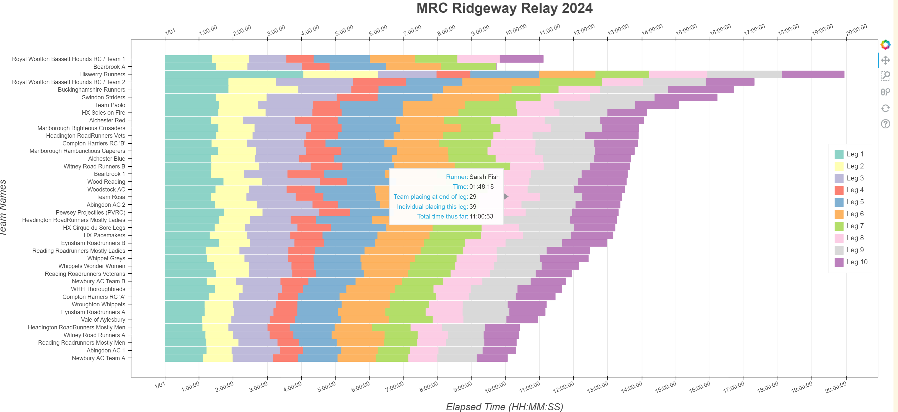

# bokeh

***NOTE:*** If viewing in github, although github will render the notebook, it will **NOT** show the plots.  To view the plots, download the notebook and run it in your local jupyter notebook server.  

## marlborough24_stacked.ipynb

The notebook reads in data from `marlborough24_data.csv` and creates a stacked horizontal bar chart.  Example of using categorical and time data.  You should see the below plot( rendered with initial uploaded version of the notebook):

